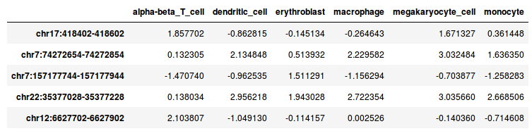

# Motifs in DNase I peaks

## **Exercise** 12.1 {-}

The exercise for this week is to compare the relation between transcription factor motif presence and DNase I signal in different cell types.

The result of your code should be a figure like the following (the values here are not real, but only shown for illustrative purposes):


This heatmap shows, for every cell type and motif combination, the difference of the mean signal for regions with a motif compared to regions without a motif.

### Data {-}

In the directory `/scratch/cfb/dnase_motifs/` you will find two files:

* `DNase_table.tsv` 
* `motifs.txt`

In addition, the human genome (version hg38) is present here:

* `/scratch/genomes/hg38/hg38.fa`

The file `DNase_table.tsv` looks like this:



This tab-separated file contains DNase I signals for six hematopoietic cell types in 10,000 genomic regions. The DNase I reads were counted, log2 transformed and normalized by scaling.

The file `motifs.txt` contains the name and consensus sequence for seven motifs.

### Retrieving sequences from a genome FASTA file. {-}

You can use the `pyfaidx` module to retrieve specific sequences from a FASTA file based on genomic coordinates. See the documentation of the module [here](https://pythonhosted.org/pyfaidx/).

First, you create a FASTA object.

```{.python}
from pyfaidx import Fasta
genome = Fasta("my_genome.fa")
```

Then, you can retrieve sequences in a dictionary-like approach.

```{.python}
my_seq = genome["chr2"][5000000:5000100]
print(my_seq.seq)
```

```
TCATGACCATAGAGAACAGACTAAAGCATATGCAGTAACATATAGAAGCATTTTTATTCATATATATGgaaagcctggaagcaatgacatcttagttgca
```

### Approach {-}

Think about your approach before you start writing code!
You will have to:

* scan sequences with the motif consensus sequences;
* determine, for every motif, which sequences have a match to the motif;
* calculate the mean signal, depending on the motif occurrence;
* calculate the difference in mean signal of sequences with a motif match and without a motif match.

### Questions {-}

* Make a correlation plot of the DNase signal in these hematopoietic cel types? Is this what you expect?
* Which motifs are specific for certain cell types?
* Does this agree with the literature?
